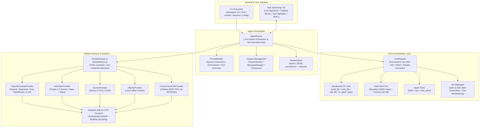

# OpenAgent

<div align="center">

[](LICENSE)
[](https://python.org)
[](tests/)
[](https://modelcontextprotocol.io)
[](pyproject.toml)

**A universal, model-agnostic terminal AI coding agent built for developers.**  
*Run with any LLM: OpenAI, Anthropic, Gemini, Ollama, OpenRouter, DeepSeek, or any proprietary JSON API.*

[Features](#-key-features) •
[Architecture](#-architecture) •
[Installation](#-installation) •
[Quick Start](#-quick-start) •
[Model Configuration](#-model--provider-configuration) •
[MCP Integration](#-model-context-protocol-mcp) •
[Configuration Reference](#-configuration-reference) •
[Contributing](#-contributing) •
[License](#-license)

</div>

---

## 💡 Why OpenAgent?

Most AI coding agents tightly couple their orchestration logic to specific vendor SDKs, forcing users into specific model ecosystems and proprietary pricing tiers.

**OpenAgent breaks vendor lock-in.** It treats models and protocols as swappable transports while providing a rock-solid, production-grade agent loop:

1. **The 3-Tier Model Escape Hatch**:
   - **L1 — Native Adapters**: First-class support for Anthropic Claude Messages, Google Gemini API, and Ollama.
   - **L2 — OpenAI-Compatible Presets**: Instant plug-and-play for 40+ providers (OpenAI, DeepSeek, Groq, Together, Mistral, xAI, Fireworks, OpenRouter, vLLM, LM Studio, etc.).
   - **L3 — Custom JSONPath Mapping**: Support **any** arbitrary enterprise HTTP API without changing a single line of code—simply specify JSONPath extraction templates.
2. **Multi-Protocol Tool Execution**:
   - Native JSON Schema function calling (T0 / T1).
   - Text-protocol codec fallback (T2) with structured code blocks for models lacking native function calling.
3. **Enterprise-Grade Sandboxing & Safety**:
   - Fine-grained permission actions (`ALLOW`, `ASK`, `DENY`).
   - Workspace confinement with strict symlink leak prevention.
   - Safe shell execution with bounded output capping (100KB) and cross-platform process tree termination.
4. **Atomic Tool-Response Integrity**:
   - Context window trimming and LLM-powered compaction strictly enforce the **Atomic Tool Pair Invariant**, guaranteeing assistant tool calls and their corresponding execution outputs are never severed.
5. **Model Context Protocol (MCP)**:
   - Full MCP 1.0 client support for `stdio` and `sse` transports with automatic registry namespacing and fault-tolerant rollback.
6. **Rich Interactive Terminal Interface**:
   - Markdown streaming, styled reasoning/thinking blocks, syntax-highlighted tool execution, interactive permission prompts, and an interactive REPL chat mode.

---

## 🏛 Architecture



---

## 🚀 Key Features

| Capability | Highlights |
|---|---|
| **Any LLM Provider** | OpenAI, Anthropic Claude, Google Gemini, Ollama, DeepSeek, Groq, Together, Mistral, xAI, OpenRouter, vLLM, and Custom JSONPath endpoints. |
| **Tool Execution** | Parallel tool execution (`asyncio.gather`), granular permission policies (`ALLOW`, `ASK`, `DENY`), automatic schema generation from docstrings and type hints. |
| **Sandboxed Filesystem** | `read_file`, `write_file`, `edit_file` (with uniqueness checks), `list_directory`, `glob_find`, and `grep_search`. Enforces strict workspace boundary confinement to prevent path traversal and symlink leaks. |
| **Safe Shell Runner** | Cross-platform command execution, bounded memory output (capped at 100KB to protect context window), configurable timeouts, and process-tree termination (`taskkill /T /F` on Windows). |
| **Agent Utilities** | `think` (structured scratchpad reasoning), `todo` (task list management), `web_fetch` (clean HTTP content extraction). |
| **Model Context Protocol** | Seamless integration with external MCP servers over `stdio` and `sse` transports with automated tool discovery, namespacing, and graceful shutdown. |
| **Context Management** | Multilingual (CJK + ASCII) token estimation, automatic heuristic and LLM-driven compaction, sliding window message management, and atomic tool-response pairing. |
| **Session Persistence** | High-performance JSONL session logs with atomic file swaps (`fsync` + `os.replace`), allowing full session restoration with `--resume <session-id>`. |
| **Rich Terminal TUI** | Real-time streaming markdown, styled thinking panels, tool call syntax highlighting, non-blocking approval prompts, and interactive REPL chat mode with history. |

---

## 📦 Installation

### Prerequisites
- Python 3.11 or higher
- Git

### Using `pip`

```bash
# Standard installation
pip install openagent

# With optional native Ollama client support
pip install openagent[ollama]
```

### Using `uv` (Recommended)

```bash
# Install tool globally or run directly via uvx
uv tool install openagent
# or
uvx openagent "Analyze the current project"
```

### From Source (Development)

```bash
git clone https://github.com/mj10612/OpenAgent.git
cd OpenAgent
uv venv
uv pip install -e ".[dev,ollama]"
```

---

## ⚡ Quick Start

### 1. Set Your API Key

```bash
# For OpenAI / OpenRouter / DeepSeek
export OPENAI_API_KEY="sk-..."

# For Anthropic Claude
export ANTHROPIC_API_KEY="sk-ant-..."

# For Google Gemini
export GEMINI_API_KEY="AIzaSy..."
```

### 2. One-Shot Task Execution (`openagent run`)

Execute a task with streaming terminal output:

```bash
# Default model (gpt-4o)
openagent "Inspect pyproject.toml and explain what dependencies are required"

# Using Anthropic Claude 3.5 Sonnet
openagent -m anthropic/claude-3-5-sonnet "Find and fix any typing errors in src/"

# Using a local Ollama model
openagent -m ollama/llama3.2 "Refactor the database queries in utils.py"

# Auto-approve all tool operations without interactive prompts (-y / --yes)
openagent -y "Run pytest and fix all failing tests"
```

### 3. Interactive REPL Mode (`openagent chat`)

Start an interactive conversation with session history and full agent capabilities:

```bash
openagent chat
# or with a specific model and workspace
openagent chat -m gemini/gemini-2.5-pro -w ./my-project
```

#### REPL In-Chat Commands:
- `/clear`: Clears conversation history and resets context window.
- `/help`: Displays available commands and keybindings.
- `/exit` or `/quit`: Closes the session gracefully.

### 4. CLI Subcommand Reference

```bash
openagent --help
```

- **`openagent run <prompt>`**: Runs a prompt with streaming output to completion.
- **`openagent chat`**: Launches an interactive REPL chat session.
- **`openagent models`**: Lists all available provider presets, default endpoints, and supported model prefixes.
- **`openagent sessions`**: Displays previous conversation sessions, timestamps, message counts, and resumption commands.
- **`openagent config`**: Prints active configuration settings and configuration file search locations.

#### Global Options:
- `-m, --model <name>`: Model reference (e.g. `gpt-4o`, `anthropic/claude-3-5-sonnet`, `gemini/gemini-2.5-pro`, `ollama/qwen2.5-coder`).
- `--base-url <url>`: Override the API base URL.
- `--api-key <key>`: Supply API key directly via CLI.
- `-w, --workspace <path>`: Set workspace root directory (default: current directory).
- `-r, --resume <session_id>`: Resume an existing conversation session.
- `-y, --yes`: Auto-approve all tool executions (non-interactive mode).
- `-c, --config <file>`: Load a custom TOML configuration file.

---

## 🔧 Model & Provider Configuration

OpenAgent automatically resolves model identifiers from provider prefixes, environment variables, configuration files, and built-in presets.

### 1. OpenAI & OpenAI-Compatible Providers

Works natively with OpenAI, DeepSeek, Groq, Together, OpenRouter, Mistral, Perplexity, Cerebras, vLLM, and LM Studio.

```bash
# OpenAI
export OPENAI_API_KEY="sk-..."
openagent -m gpt-4o "Refactor src/main.py"

# DeepSeek
export DEEPSEEK_API_KEY="sk-..."
openagent -m deepseek/deepseek-chat "Write unit tests for authentication"

# Groq (Ultra-fast inference)
export GROQ_API_KEY="gsk_..."
openagent -m groq/llama-3.3-70b-versatile "Summarize project structure"

# OpenRouter (Unified router for 200+ models)
export OPENROUTER_API_KEY="sk-or-..."
openagent -m openrouter/anthropic/claude-3.5-sonnet "Analyze performance bottlenecks"

# Local vLLM / LM Studio / llama.cpp
openagent -m vllm/my-model --base-url "http://localhost:8000/v1" "Optimize query"
```

### 2. Anthropic Claude

```bash
export ANTHROPIC_API_KEY="sk-ant-..."
openagent -m anthropic/claude-3-5-sonnet "Write a comprehensive test suite"
openagent -m anthropic/claude-3-haiku "Quickly check spelling in README.md"
```

### 3. Google Gemini

```bash
export GEMINI_API_KEY="AIzaSy..."
openagent -m gemini/gemini-2.5-pro "Review system architecture"
openagent -m gemini/gemini-2.5-flash "Generate docstrings for public functions"
```

### 4. Ollama (Offline Local LLMs)

No API key required! Ensure Ollama is running (`ollama serve`).

```bash
openagent -m ollama/llama3.2:latest "Document all classes in src/core"
openagent -m ollama/qwen2.5-coder:7b "Implement binary search algorithm"
```

### 5. Custom JSONPath HTTP Provider

Connect OpenAgent to **any** internal or proprietary REST API by specifying JSONPath response mappings:

```toml
# openagent.toml
model = "my-internal-model"
base_url = "https://internal-ai.corp.net/v2/generate"
api_key = "corp-token-xyz"

[custom_provider]
chat_endpoint = "" # base_url already points to the full generation endpoint
auth_scheme = "bearer"
jsonpath_text = "response.output.text"
jsonpath_thinking = "response.output.reasoning"
jsonpath_tool_calls = "response.output.actions[*]"
jsonpath_input_tokens = "response.metrics.prompt_tokens"
jsonpath_output_tokens = "response.metrics.completion_tokens"
```

---

## 🔌 Model Context Protocol (MCP)

OpenAgent includes built-in support for the [Model Context Protocol](https://modelcontextprotocol.io). Connect any `stdio` or `sse` MCP server directly into the agent's tool registry.

Add MCP servers to your `./openagent.toml` or `~/.config/openagent/config.toml`:

```toml
# SQLite MCP Server via uvx
[[mcp_servers]]
name = "sqlite"
transport = "stdio"
command = "uvx"
args = ["mcp-server-sqlite", "--db-path", "./data/app.db"]

# GitHub MCP Server with environment variables
[[mcp_servers]]
name = "github"
transport = "stdio"
command = "npx"
args = ["-y", "@modelcontextprotocol/server-github"]
env = { GITHUB_PERSONAL_ACCESS_TOKEN = "ghp_..." }

# Remote SSE MCP Server
[[mcp_servers]]
name = "remote_analytics"
transport = "sse"
url = "https://analytics-mcp.internal.company.com/sse"
```

Tools provided by MCP servers are automatically prefixed with the server name (e.g. `sqlite__read_query`, `github__create_pull_request`) and are subject to the same danger policies as native tools.

---

## ⚙️ Configuration Reference

Configuration files are loaded hierarchically:
1. Built-in defaults
2. User global config (`~/.config/openagent/config.toml` or `~/.openagent/config.toml`)
3. Project local config (`./openagent.toml` or `./.openagent.toml`)
4. Environment variables (`OPENAGENT_*`)
5. Command-line flags (highest precedence)

### Full `openagent.toml` Example:

`max_tokens` limits generated output. `context_window` optionally overrides the total
model context capacity; input budgeting reserves space for output and tool schemas.
When migrating an old input-budget setting, move that value to `context_window`.

```toml
# Default model identifier
model = "gpt-4o"

# Optional credentials (recommended to use environment variables instead)
# api_key = "sk-..."
# base_url = "https://api.openai.com/v1"

# Sampling & Limits
temperature = 0.2
top_p = 0.95
max_tokens = 4096
# Optional input + output context window override; defaults to provider window
# context_window = 128000
max_tool_iterations = 25

# Execution safety (true = bypass approval prompts)
auto_approve = false

# Workspace directory
workspace = "."

# Custom system instructions appended to the default prompt
extra_instructions = [
  "Always follow PEP 8 and use Google docstrings.",
  "Write unit tests with pytest for all new functions."
]

# Tool danger policies: "allow", "ask", or "deny"
[danger_policy]
none = "allow"       # read_file, glob_find, grep_search, think, todo
network = "ask"        # web_fetch
write = "ask"        # write_file, edit_file
execute = "ask"        # shell execution
# MCP tools use the execute policy regardless of server annotations.

# MCP Server Definitions
[[mcp_servers]]
name = "filesystem_extra"
transport = "stdio"
command = "npx"
args = ["-y", "@modelcontextprotocol/server-filesystem", "./docs"]
```

---

## 🛠 Developer Guide

### Running Tests

OpenAgent features a comprehensive unit and integration test suite with 100% mocked offline execution (no external network calls required):

```bash
# Run full test suite
pytest -v

# Run specific subsystem tests
pytest tests/test_tools.py -v
pytest tests/test_mcp.py -v
pytest tests/test_runner.py -v
pytest tests/test_cli_config.py -v
```

### Static Type Checking & Code Quality

OpenAgent enforces strict typing and code formatting standards:

```bash
# Type checking across all modules and tests
mypy src tests

# Fast linting and import ordering
ruff check src tests

# Auto-formatting
ruff format src tests
```

---

## 🤝 Contributing

Contributions are warmly welcome! Whether you are:
- Adding native adapters for new LLM providers (`src/openagent/providers/`)
- Adding new presets to `src/openagent/core/presets.py`
- Adding native developer tools to `src/openagent/tools/`
- Improving terminal UI rendering or prompt templates

### Contribution Workflow:
1. Fork the repository on GitHub (`https://github.com/mj10612/OpenAgent`).
2. Create a feature branch (`git checkout -b feature/my-cool-feature`).
3. Commit your changes with clear semantic commit messages.
4. Verify all tests and linters pass (`pytest -v`, `mypy src tests`, `ruff check src tests`).
5. Open a Pull Request.

---

## 📄 License

OpenAgent is licensed under the **Apache License, Version 2.0**. See the [LICENSE](LICENSE) file for details.

```
Copyright 2026 The OpenAgent Contributors

Licensed under the Apache License, Version 2.0 (the "License");
you may not use this file except in compliance with the License.
You may obtain a copy of the License at

    http://www.apache.org/licenses/LICENSE-2.0

Unless required by applicable law or agreed to in writing, software
distributed under the License is distributed on an "AS IS" BASIS,
WITHOUT WARRANTIES OR CONDITIONS OF ANY KIND, either express or implied.
See the License for the specific language governing permissions and
limitations under the License.
```


## Session and workspace management

The REPL supports `/model [provider/model]`, `/tokens` (alias `/usage`), and
`/tools`. Token counts are cumulative for the current REPL; context utilization
uses the local estimator. For multiline input, enter `"""` or `'''` on its own
line, type or paste the content, and close with the same delimiter. Ordinary
Enter continues to submit a single line.

Session lists show complete IDs. Resume and delete accept a unique ID prefix;
ambiguous prefixes and unknown IDs fail with a clear error.

```bash
openagent sessions delete <id-or-prefix> --yes
openagent sessions rm <id-or-prefix> --yes
openagent sessions prune --older-than 30 --yes
openagent sessions --clear --yes
```

Destructive session commands ask for confirmation unless `--yes` is supplied.
Filesystem tools include confirmation-gated `delete_file(path)` and
`move_file(source, destination)`. Moving refuses an existing destination; deletion
accepts regular files only. Both paths remain within the workspace.

System instructions automatically include workspace `AGENTS.md`, `CLAUDE.md`,
`.openagent/rules.md`, and `.openagent/instructions.md` when present. External
MCP descriptions and tool results are marked as untrusted data. MCP tools use
names such as `server__tool`, always require the execute permission policy by
default, and refresh after a disconnected server is reconnected. Failed calls
are never automatically replayed, because they may have had side effects.

`web_fetch` asks for permission, downloads at most 2 MB, and rejects private or
loopback destinations, including redirects. Filesystem searches skip common
repository metadata, dependency directories, large files, and binary files.
Shell child processes do not inherit provider credential variables, and stdin
is closed. An approved shell command still has the process account's filesystem
access; use an OS sandbox for stronger isolation.

Configuration paths resolve relative to the containing TOML file. Saved settings
preserve Unicode and all MCP options. Configuration is written atomically with
owner-only permissions on POSIX; on Windows it inherits the destination folder
ACL. Prefer environment variables for secrets (see [SECURITY.md](SECURITY.md)).

Azure and Bedrock preset identifiers currently fail explicitly: native Azure
and AWS signing adapters are not implemented. Use an appropriately configured
OpenAI-compatible gateway instead. Native adapters are Anthropic, Gemini, and
Ollama.
